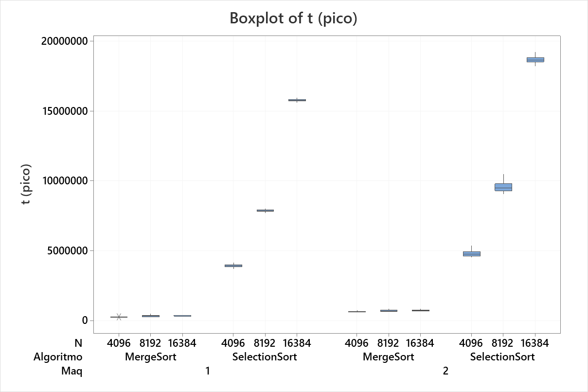
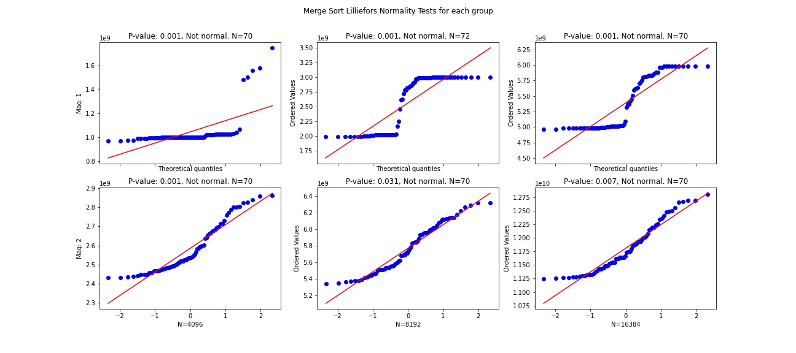
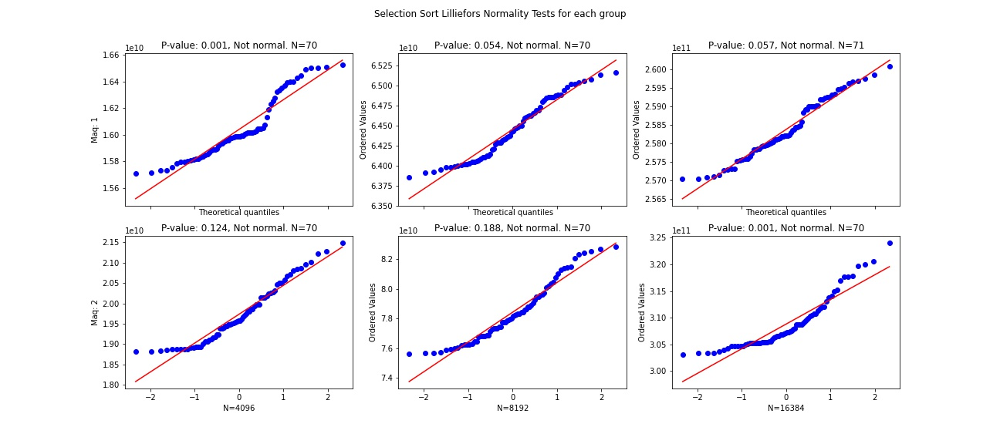
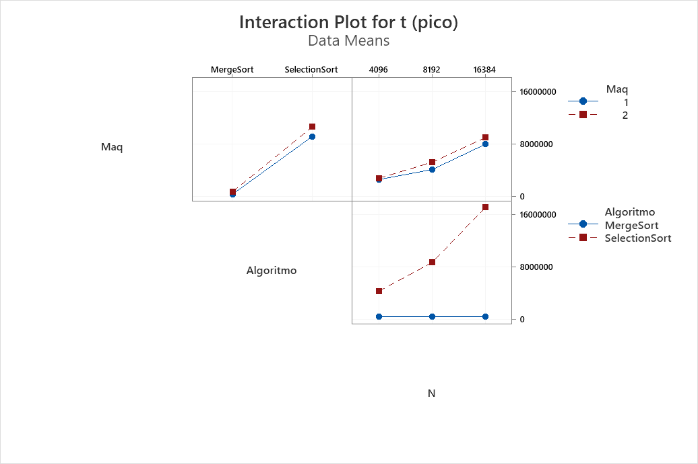

# complexity-experiment
Experiments with sorting algorithms

## Objective

The objective of this project is to analyze aspects of the performance of a computer system with the execution of sorting algorithms, applying the methodology of conducting experiments. Therefore, an experiment will be designed to find how the execution of a type of ordering algorithm, the input size and the computer system interact with each other and their level of impact on the performance of each of these factors.

Response variable:

* Execution time 

Factors of study: 

* Machine
* Input size
* Sorting algorithm(MergeSort, SelectionSort).

## Documentation 

[Problem Statement](https://docs.google.com/document/d/1V0oORER-K9z69PqIN6wnqCdHKLFmxqEvDGV7TB2PkKY/edit)

[Report](https://docs.google.com/document/d/1ixvBqJ8Ou_8lw7Jp_GtO5czMWiyuAkU3YfxihxteQUg/edit)

[Data](https://docs.google.com/spreadsheets/d/1JVGLnGMZRhRQUzsIgj7vXyebRMoOUcK51JssKJHVNJI/edit?usp=sharing)

## Results

## Exploratory data analysis

### ANOVA

## Authors

[Sebastián García Acosta](https://github.com/SebasGarcia08)

[Christian Gallo Peláez](https://github.com/Gallo9923)

[Juan Fernando Angulo Salvador](https://github.com/Juanferas)